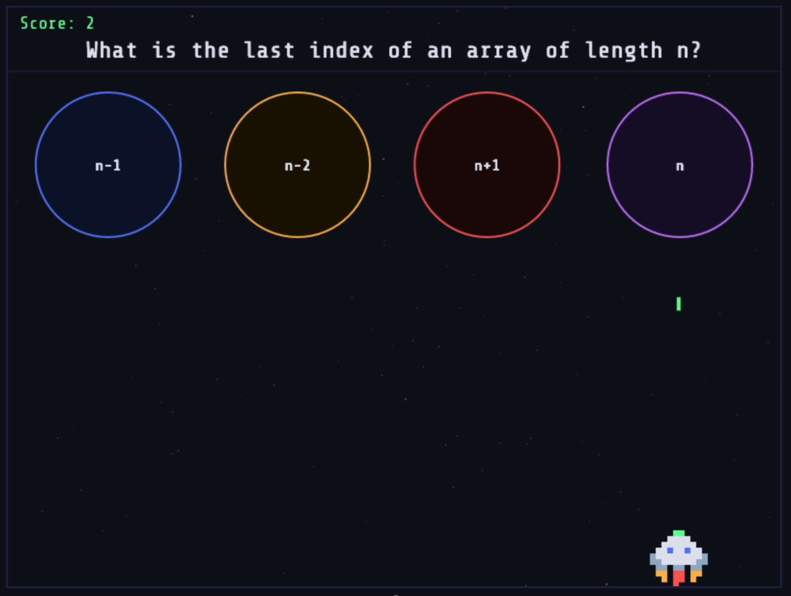
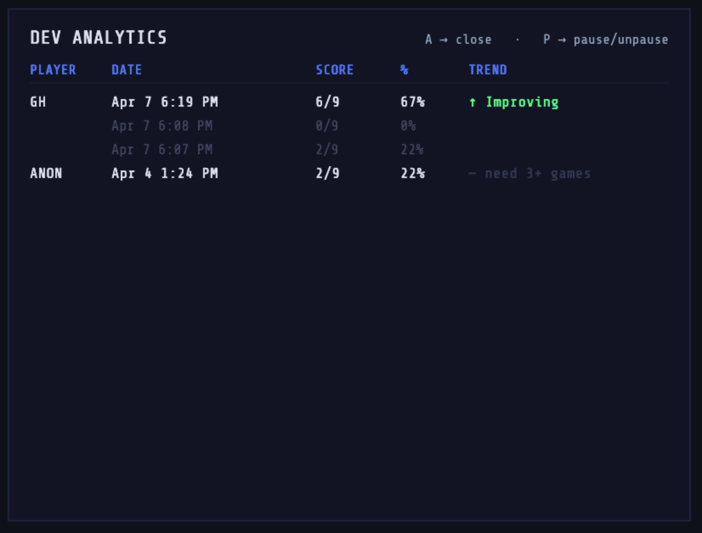
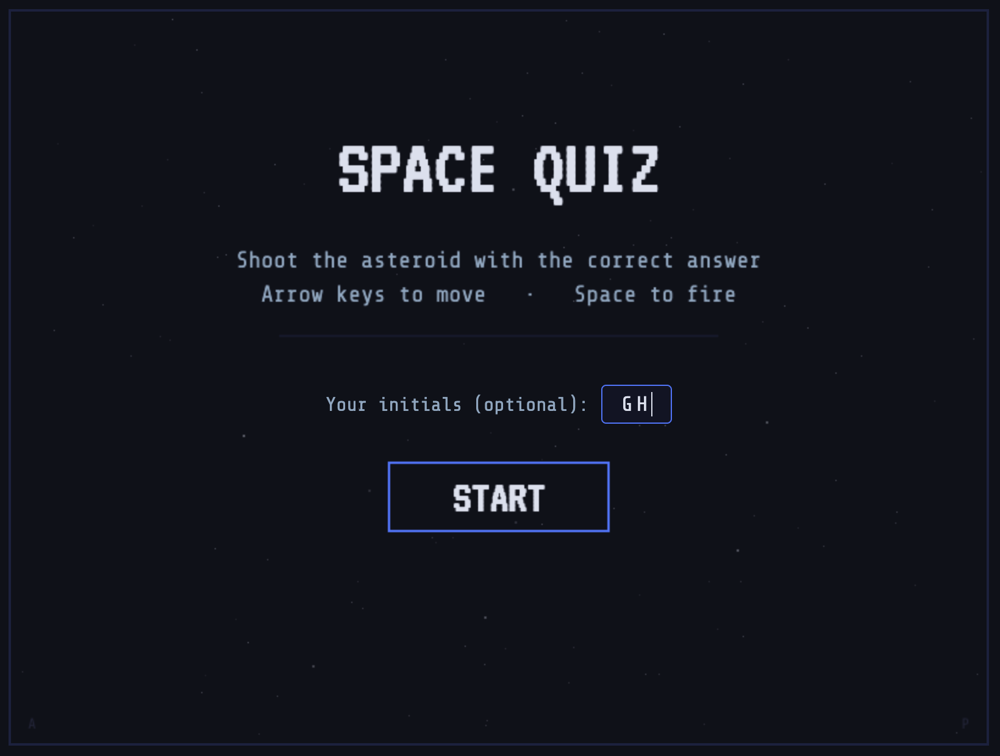
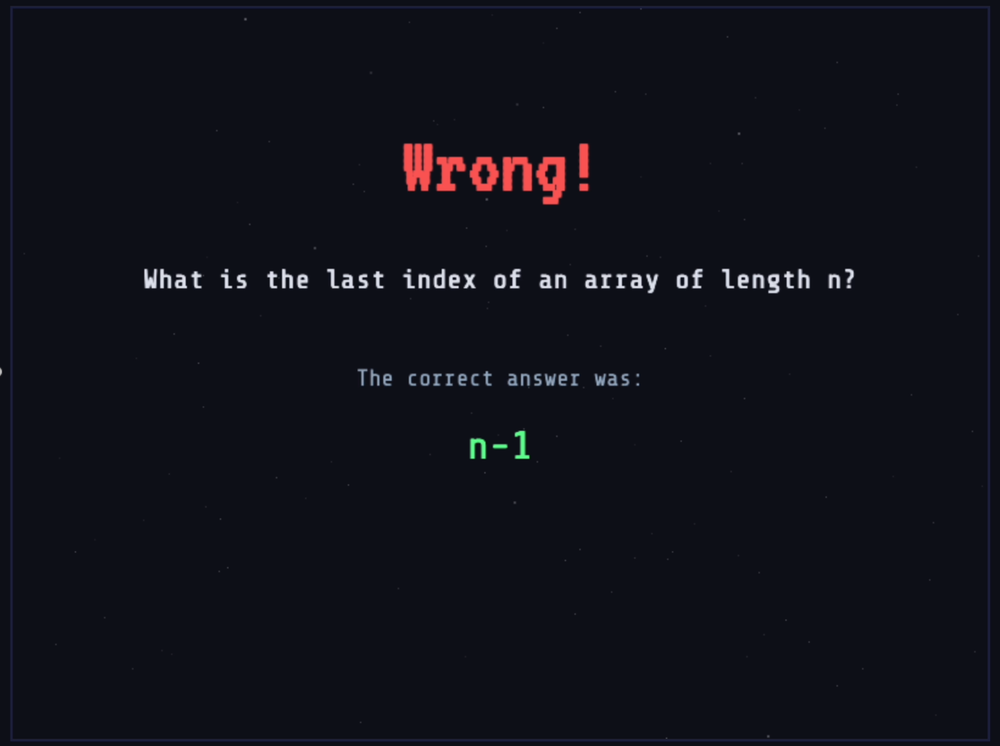
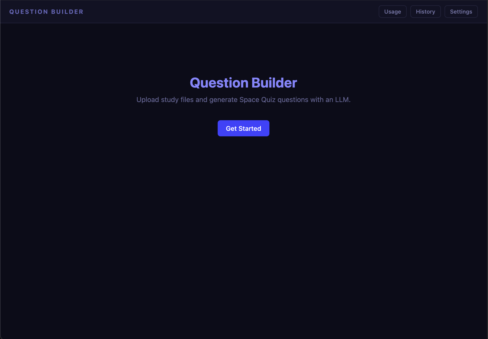
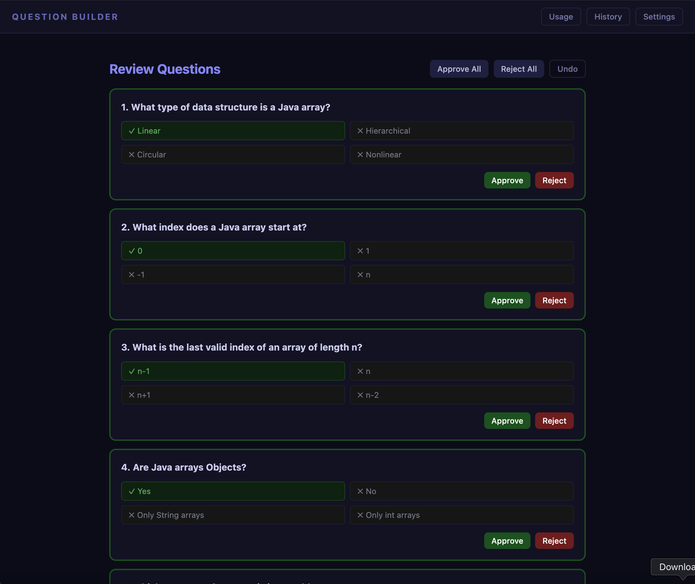
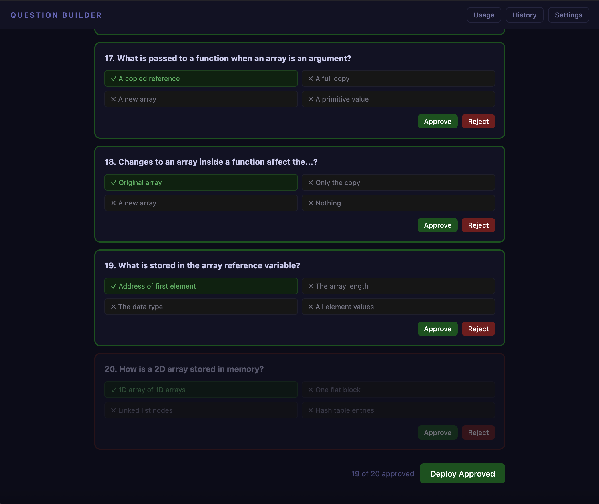

# Space Quiz

A browser-based asteroid shooter built to make studying more effective — and to learn what it actually feels like to build software.



*Built by Ari Moy*

---

## Why I Built This

I'm taking an introductory CS course — not to switch careers, but because I've always wanted to close the gap between how I think about products and how the engineers building them actually work. That curiosity is what I love about my job.

I needed a better way to study. Flashcards work, but they're passive. I wanted something that would make me care about getting the right answer. An asteroid shooter mapped cleanly onto a multiple-choice question: one correct answer, three distractors, one high-stakes decision per round. The mechanic had to fit the task.

The second goal was learning to build with Claude Code. I'd always wanted to create something in code but had no language background. What surprised me was how fast the core game came together, and how useful Claude was as a thinking partner — I could ask for structured alternatives on design decisions, not just code output.

Along the way I hit the predictable friction: AI tools sometimes produce output without checking their own work first. I came across [a post describing an agentic pipeline](https://medium.com/@elliotJL/your-ai-has-infinite-knowledge-and-zero-habits-heres-the-fix-e279215d478d) — a chain of models that catch known error types before the response reaches the user — and that became a separate thread of curiosity. Building in code rather than a chat UI means you can eventually wire that kind of automated review in, rather than prompting for it manually every time.

Once I had the workflow set up (VS Code, Git, local server), I started creating branches deliberately — each one a different version of the game — so I could compare approaches and learn from the differences. Two evenings, several deployable versions. It felt like running sprints.

---

## How I Worked

The biggest surprise was how fast working software came together — and how quickly that speed became a trap. Without upfront structure, small tweaks multiplied into a long tail of micro-changes that were hard to prioritize. I learned that stepping back to sketch things out before building would have saved time, not cost it. Offline thinking is just as load-bearing as the actual work.

What kept me grounded was a single goal I returned to for every feature decision: **maximum retention, minimum building effort.**

Three decisions that came from that filter:

**Wrong-answer feedback.** I researched whether to show the correct answer immediately or in a final review screen. Immediate feedback wins on retention. That's what I built.

**Analytics scope.** I considered breaking performance down by topic — which questions the user struggled with most. I cut it. At the "get the material into your head" stage of learning, high-level signals like "improving" or "declining" are sufficient. The added complexity wasn't worth it yet.

**No login.** I considered a login system for personalized score history. I kept it lightweight instead: enter initials, scores filter to match. This was a deliberate choice — I was going to be the only real user, a backend added no value, and keeping it to initials fit the arcade feel. It also let me use different initials to separate QA runs from real study sessions.



---

## What It Does

### The Game — `space-quiz.html`

A question appears at the top of the screen. Four asteroids fall, each labeled with an answer. Move the gun with arrow keys, fire with Space, shoot the correct one.



Wrong answer? The correct answer is shown immediately before the game ends — not in a summary screen at the end. That decision was research-backed: immediate corrective feedback produces better retention than delayed review.



---

### The Question Builder — `question-builder.html`

A companion tool that generates quiz questions from your study files using an LLM. Upload notes (`.docx`, `.java`, images), send them to Claude, review and approve questions one by one, then download a `questions.json` file to drop into the game.



The review step is intentional — it's a check that the LLM correctly translated the material from your notes into accurate questions, and that nothing got garbled or hallucinated before it goes into your study set.





---

### Tests — `space-quiz-tests.html` & `question-builder-tests.html`

Browser-based unit tests covering the pure logic in both tools: collision detection, question validation, shuffle algorithms, HTML sanitization. Open either file in a browser and the results render inline.

---

## Technical Snapshot

- **No framework, no build step.** Each tool is a single self-contained HTML file with inline CSS and JS. Open it, it runs.
- **Game loop** uses `requestAnimationFrame` with delta-time capped at 50ms to prevent position jumps when the browser tab is backgrounded.
- **Questions** are loaded from `questions.json` via `fetch()`, which means the game needs a local server (browsers block fetch on `file://`).
- **Score history** is stored in `localStorage`, keyed by initials. No backend, no accounts.
- **LLM integration** in the question builder supports both Anthropic and OpenAI-compatible APIs — auto-detected by endpoint URL.
- **Unit tests** cover pure functions: collision detection, shuffle, validation, HTML sanitization.

---

## How to Run

Requires Python (for a local server):

```bash
python3 -m http.server 8000
```

Then open in a browser:

| URL | What it is |
|-----|-----------|
| `http://localhost:8000/space-quiz.html` | The game |
| `http://localhost:8000/question-builder.html` | Question generator |
| `http://localhost:8000/space-quiz-tests.html` | Game unit tests |
| `http://localhost:8000/question-builder-tests.html` | Builder unit tests |

Stop the server with `Ctrl+C`.

**Question builder setup:** click Settings (top right), enter your Anthropic API key, endpoint `https://api.anthropic.com/v1/messages`, and model `claude-sonnet-4-6`. The key is stored in your browser's local storage only — never paste it into any file in this repo.
